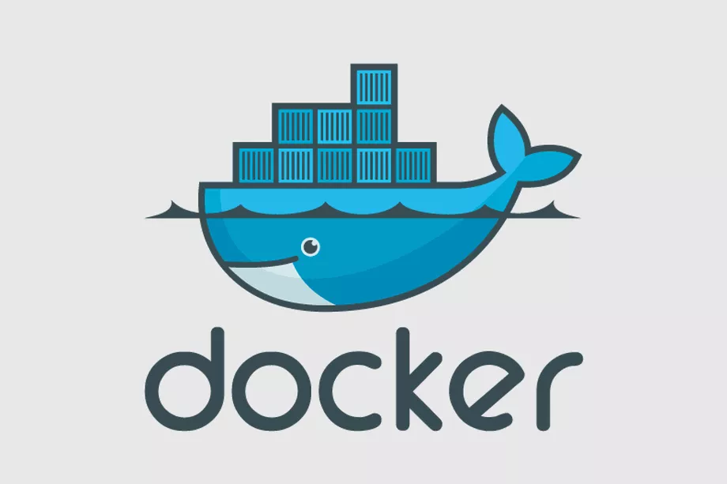

---

type: "post"
title: "Easy Automation with GNU Make- Beginner's Guide"
category: "tutorial"
date: "2019-03-13"
slug: "/blog/gnu-make-for-beginners"
postImage: "./img/redwoods.jpg"
metaDescription: "Make is a build automation tool that assists in building complicated applications. Learn to use Make in your projects!"

---

Make is a build tool that became (relatively) popular with the rise of Unix. GNU Make is the most common version, present on both Linux and MacOS. It's used to build even complicated software like the Linux kernel.

Of course, Make does not have to be complicated. Like most other Unix tools, it's based on a few simple ideas!

## Make Just Builds Files

A `Makefile` is usually just a set of instructions on how to build a file. Instructions generally are programs on the system (though not necessarily run by a shell!).

```makefile
hello.txt:
      touch hello.txt
```

Try it out! If you wrote this in a `Makefile`, then entered `make hello.txt`, you would have the file `hello.txt` created in your directory.

If you ran it _again_, it'd look like this:

```bash
$ make hello.txt
touch hello.txt
$ make hello.txt
make: 'hello.txt' is up to date
```

Make sees that there is a `hello.txt` file, and does not run the command again.

## Files Have Dependencies

Sometimes, you'll need to do more than just create text files using `touch`. Surprising right? Thankfully, you can chain your contrived dependencies together using Make, and it's super easy:

```makefile
awesome.txt: hello.txt
        cp hello.txt awesome.txt

hello.txt:
        touch hello.txt
```

The instructions on creating an `awesome.txt` now include `hello.txt` as a _dependency_. Make looks for instructions on how to create a file of the same name, and checks if it's up to date.

That's also how to create the ubiquitous `make build` or `make test` commands, by the way:

```makefile
.PHONY: build
build: awesome.txt

awesome.txt: hello.txt
        cp hello.txt awesome.txt

hello.txt:
        touch hello.txt
```

**PSST:** `.PHONY: <command>` just means that the command name does not correspond to a file. Otherwise, Make would look for a file named `build`, which is probably not what you want.

## Automate Docker Releases



> Look at this adorable whale! [www.docker.com](https://www.docker.com/)

Docker is pretty easy to use, but I have found that building and saving releases is awkward. It's a little too easy to lose track of version numbers and to forget the "latest" container.

Plus, any command entered by hand that warrants a backslash _probably shouldn't be entered by hand_.

As you can probably guess, Make to the rescue. Let's automate image building and tagging! Create a new directory that looks something like this:

```
make-docker/
├── dist/
├── Dockerfile
├── Makefile
└── VERSION

1 directory, 4 files
```

You can use whatever you would like in your `Dockerfile`! Here's a "Hello World" Docker image.

```docker
FROM alpine:latest

RUN echo "Hello World" > greeting.txt

CMD cat greeting.txt
```

We'll mark this as version 0.1.0 in our `VERSION` file:

```
0.1.0
```

Finally, let's add the contents of our `Makefile`:

```makefile
VERSION := $(shell cat VERSION)
IMAGE := my-hello-world

.PHONY: build
build: dist/$(IMAGE)-$(VERSION).tar.gz

dist/$(IMAGE)-$(VERSION).tar.gz:
	docker build -t "$(IMAGE):$(VERSION)" -t "$(IMAGE):latest" .
	docker save "$(IMAGE):$(VERSION)" > dist/$(IMAGE)-$(VERSION).tar.gz
```

Our `Makefile` reads the value stored in `VERSION` upon any invocation of `make`. Make then relays the commands to Docker, which builds our images for us. Docker tags the images as both `$VERSION` and `latest`.

By saving a .tar file for the docker image, our requirements for `make build` are met. Subsequent runs with the same version will not create extra images!

Congrats! You can now create a new release of your image with just one command.

### Wrap Up

That's a quick intro to Make! You now know enough of the basics to get out there and use Make in your projects.

To learn more about Make, [the manual](https://www.gnu.org/software/make/manual/make.html) is a pretty great resource that explains a lot more than this overview. Happy Making!
